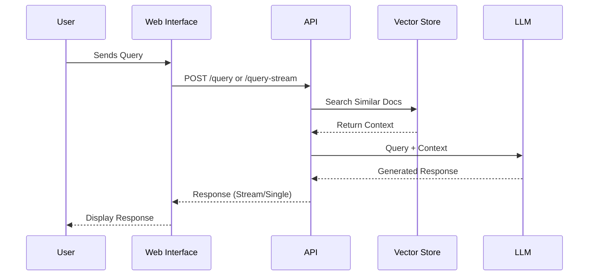
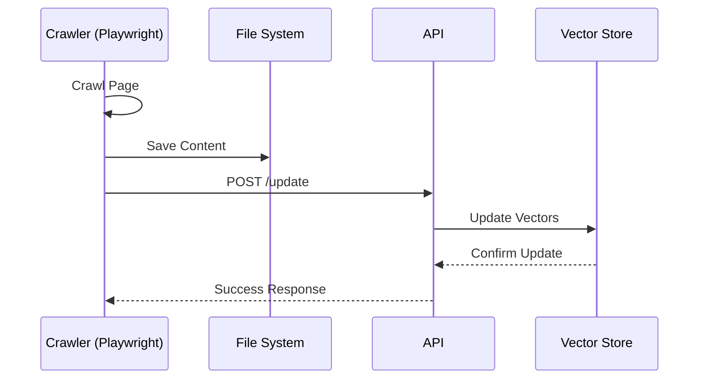
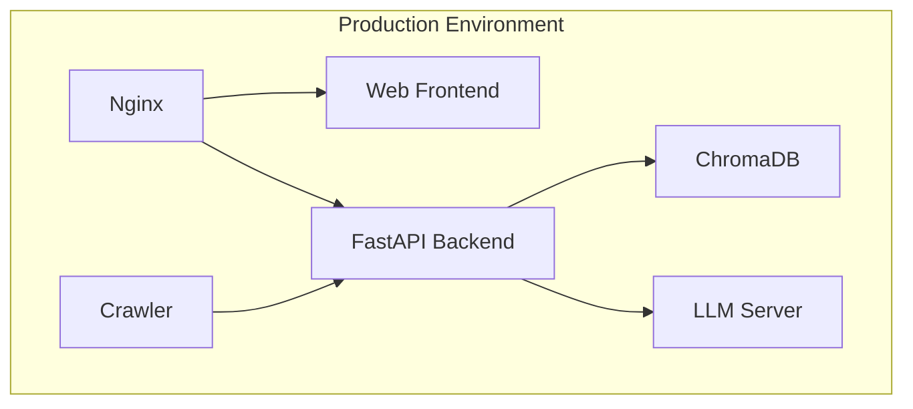

# POE-RAG Architecture

## System Components

### 1. Web Crawler
- Built with Playwright for cross-platform compatibility
- Asynchronous content fetching
- HTML to Markdown conversion
- Structured content extraction
- Automatic file management

### 2. RAG System
- FastAPI backend
- ChromaDB vector store
- OpenAI-compatible LLM integration
- Environment-based configuration
- Server-Sent Events (SSE) streaming

### 3. Web Interface
- Next.js frontend
- Real-time chat UI
- SSE-based streaming
- Markdown rendering
- Thread management

## Data Flow

### Query Flow


### Content Update Flow


## Security Considerations

1. **API Security**
   - Rate limiting
   - Input validation
   - Error handling
   - Secure headers
   - Environment variable protection

2. **Data Security**
   - File system permissions
   - API key management
   - Content validation
   - Safe content storage

3. **Web Security**
   - CORS configuration
   - XSS prevention
   - CSRF protection
   - Content sanitization

## Performance Optimizations

1. **Crawler**
   - Playwright optimization
   - Efficient parsing
   - Content caching
   - Resource cleanup

2. **RAG System**
   - Vector caching
   - Batch processing
   - Query optimization
   - Stream buffering

3. **Web Interface**
   - Component memoization
   - Lazy loading
   - Response caching
   - Efficient streaming

## Deployment Architecture



### Infrastructure Requirements
- CPU: 4+ cores
- RAM: 16GB+ (32GB recommended)
- Storage: 100GB+ SSD
- Network: High bandwidth for LLM/crawler

### Scaling Considerations
1. **Horizontal Scaling**
   - Multiple API instances
   - Load balancer configuration
   - Session management
   - Crawler distribution

2. **Vertical Scaling**
   - Vector store optimization
   - LLM batch processing
   - Memory management
   - Storage efficiency

## Environment Configuration

### RAG System
```env
LLM_API_KEY=your_api_key
LLM_BASE_URL=http://your-llm-server:1234/v1
LLM_MODEL=your-model-name
```

### Web Interface
```env
NEXT_PUBLIC_API_URL=http://localhost:8000
```

## Monitoring and Logging

1. **Application Logs**
   - API request/response
   - Crawler activities
   - LLM interactions
   - Error tracking

2. **System Metrics**
   - Resource usage
   - Response times
   - Success rates
   - Vector store stats

3. **User Analytics**
   - Query patterns
   - Response quality
   - Usage statistics
   - Error rates 