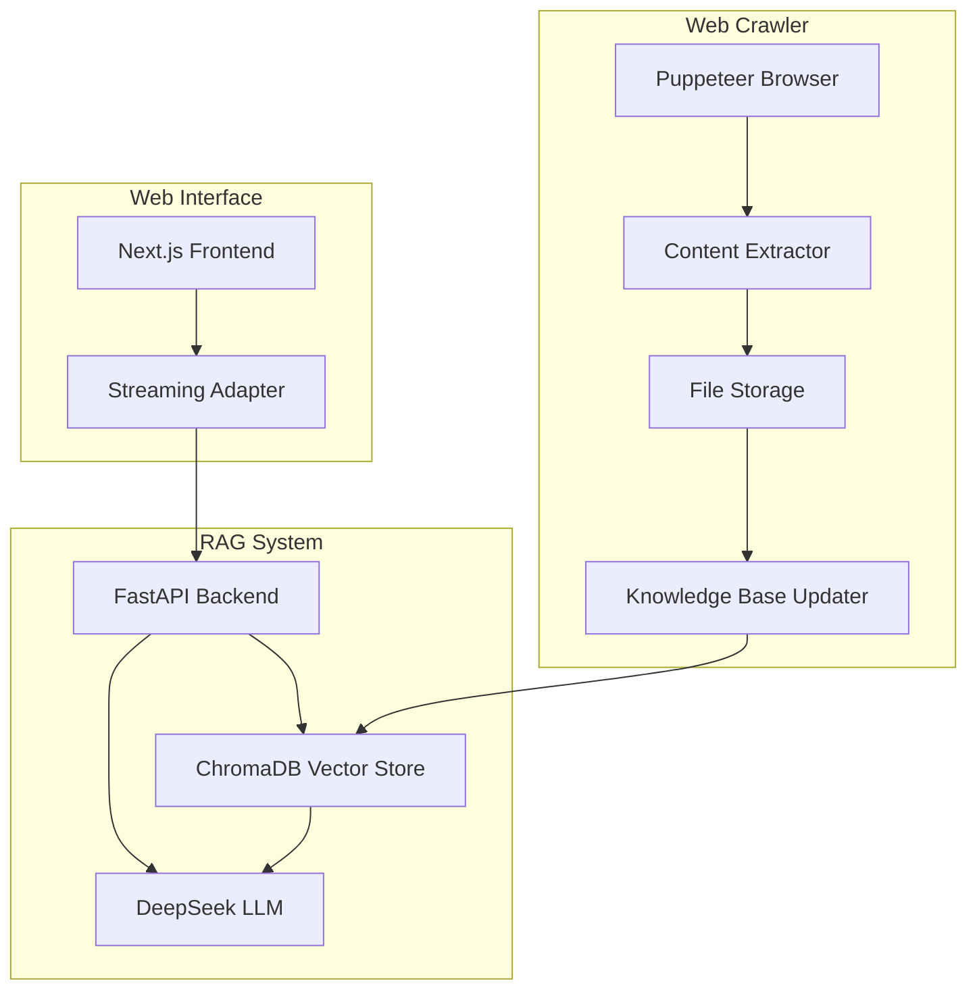
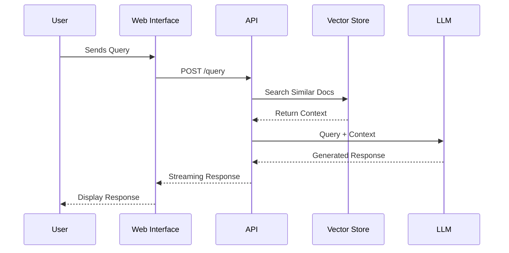
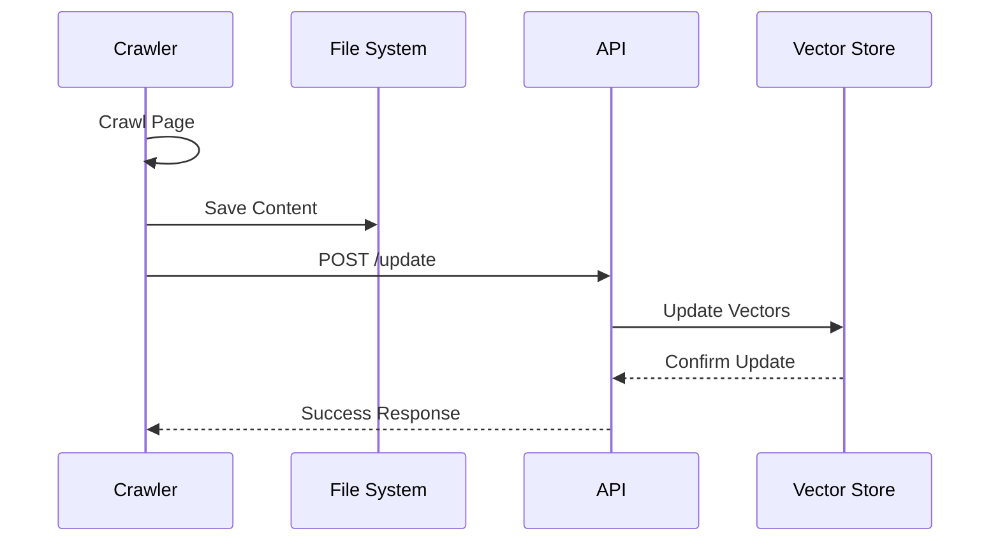
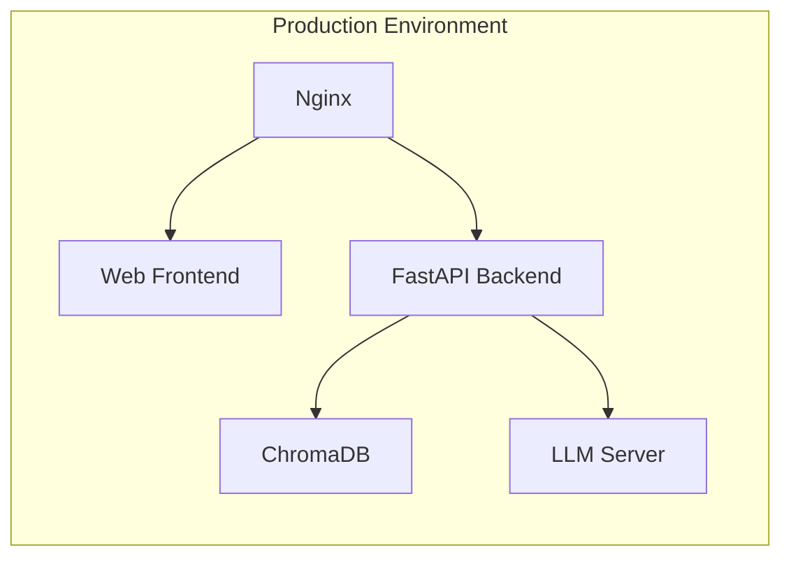

# POE-RAG Technical Architecture

## System Overview

POE-RAG is a Retrieval-Augmented Generation system designed to provide accurate, context-aware responses about Path of Exile 2. The system consists of three main components: Web Crawler, RAG System, and Web Interface.



## Component Architecture

### 1. Web Crawler (`/crawler`)

#### Core Components
- **CLI Interface** (`cli.py`)
  - Handles command-line arguments
  - Manages crawler execution flow
  - Provides user feedback

- **Crawler Engine** (`poe2db_crawler.py`)
  - Uses Puppeteer for JavaScript rendering
  - Implements asynchronous page loading
  - Handles content extraction and formatting

#### Data Flow
1. URL Input → Puppeteer Browser
2. Rendered Content → BeautifulSoup Parser
3. Structured Content → Markdown Formatter
4. Formatted Content → File Storage
5. File → Knowledge Base Update

#### Key Features
- Asynchronous operation using `asyncio`
- Headless browser automation
- Markdown content formatting
- Automatic metadata addition
- Error handling and logging

### 2. RAG System (`/rag`)

#### Components
- **API Layer** (`api.py`)
  ```python
  FastAPI
  ├── /query         # Standard query endpoint
  ├── /query-stream  # Streaming response endpoint
  └── /update        # Knowledge base update endpoint
  ```

- **Knowledge Base** (`knowledge_base.py`)
  - ChromaDB vector store
  - Document embedding
  - Similarity search
  - Collection management

- **LLM Integration** (`llm_wrapper.py`)
  - DeepSeek model integration
  - Prompt management
  - Response streaming
  - Context handling

#### Data Flow
1. Query Input → FastAPI
2. Query → ChromaDB (retrieval)
3. Retrieved Context + Query → LLM
4. LLM Response → Streaming/Direct Response

#### Technical Details
- **Vector Store**
  - Embedding Model: ChromaDB default
  - Collection Structure:
    ```json
    {
      "id": "unique_id",
      "text": "document_content",
      "metadata": {
        "source": "url",
        "timestamp": "iso_date"
      }
    }
    ```

- **LLM Integration**
  - Model: DeepSeek-R1-Distill-LLama-8B
  - Context Window: 8K tokens
  - Temperature: Dynamic based on query type
  - Streaming Support: Server-Sent Events (SSE)

### 3. Web Interface (`/web`)

#### Components
- **React Components**
  ```
  components/
  ├── Chat/
  │   ├── MessageList
  │   ├── InputBox
  │   └── StreamingMessage
  ├── Layout/
  └── Common/
  ```

- **State Management**
  - React Context for global state
  - Local state for UI components
  - SSE connection management

#### Technical Implementation
- **Chat Interface**
  ```typescript
  interface Message {
    role: 'user' | 'assistant';
    content: {
      type: 'text';
      text: string;
    }[];
  }

  interface ChatState {
    messages: Message[];
    threadId: string;
    isStreaming: boolean;
  }
  ```

- **Streaming Implementation**
  - SSE connection handling
  - Chunked response processing
  - Progressive rendering
  - Error recovery

## Data Flow Architecture

### Query Flow


### Content Update Flow


## Security Considerations

1. **API Security**
   - Rate limiting
   - Input validation
   - Error handling
   - Secure headers

2. **Data Security**
   - File system permissions
   - Environment variable protection
   - API key management

3. **Web Security**
   - CORS configuration
   - XSS prevention
   - CSRF protection

## Performance Optimizations

1. **Crawler**
   - Connection pooling
   - Resource cleanup
   - Efficient parsing

2. **RAG System**
   - Vector caching
   - Batch processing
   - Query optimization

3. **Web Interface**
   - Component memoization
   - Lazy loading
   - Response caching

## Deployment Architecture



### Infrastructure Requirements
- CPU: 4+ cores
- RAM: 16GB+ (32GB recommended)
- Storage: 100GB+ SSD
- Network: High bandwidth for LLM communication

### Scaling Considerations
1. **Horizontal Scaling**
   - Multiple API instances
   - Load balancer configuration
   - Session management

2. **Vertical Scaling**
   - Vector store optimization
   - LLM batch processing
   - Memory management

## Monitoring and Logging

1. **System Metrics**
   - API response times
   - LLM latency
   - Vector store performance
   - Memory usage

2. **Application Logs**
   - Crawler activity
   - Query patterns
   - Error tracking
   - User interactions

3. **Alert System**
   - Service health checks
   - Error rate thresholds
   - Resource utilization
   - API availability 